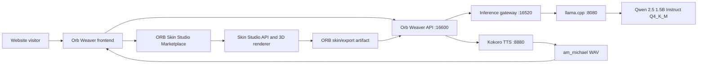

# ORB Runtime Topology

## Runtime contract

Orb Weaver owns visitor interaction, cognition orchestration, speech requests, and website guidance. ORB Skin Studio owns the visual skin, 3D asset, marketplace, and export workflow. The Studio never becomes a second conversational runtime.



## Supervised services

| Unit | Role | Endpoint | Restart behavior |
| --- | --- | --- | --- |
| `orb-kokoro-tts.service` | Kokoro speech synthesis | `127.0.0.1:8880/speak` | Always restart, 5-second delay |
| `orb-llamacpp.path` | Starts cognition only after the GGUF is complete | model path watcher | Boot-enabled |
| `orb-llamacpp.service` | llama.cpp model server | `127.0.0.1:8080/v1` | Restart on failure |
| `orb-inference-gateway.service` | Stable Ollama-compatible boundary | `127.0.0.1:16520/api/generate` | Always restart |
| `orb-weaver-api.service` | Website ORB API | `127.0.0.1:16600` | Always restart |

The services are user-level systemd units. User lingering must be enabled for them to start after boot without an interactive login.

```bash
deploy/systemd/user/install.sh
```

The installer copies the unit templates into `~/.config/systemd/user`, creates
`~/.config/orb-weaver/inference.env` and `~/.config/orb-weaver/runtime.env`
when they do not already exist, enables user lingering, and starts the runtime.

## Locked runtime values

- Cognition model: `Qwen2.5-1.5B-Instruct-Q4_K_M.gguf`
- Cognition engine: `llama.cpp`, alias `orb-auto`
- Gateway endpoint: `http://127.0.0.1:16520/api/generate`
- Speech engine: `Kokoro`
- Speech profile: `am_michael`
- Speech endpoint: `http://127.0.0.1:8880/speak`
- Audio output: 24 kHz mono WAV

## Verification order

1. `curl http://127.0.0.1:8880/health` confirms Kokoro, CUDA, and `am_michael`.
2. `curl http://127.0.0.1:8080/health` confirms the llama.cpp model server after the GGUF download completes.
3. `curl http://127.0.0.1:16520/v1/models` confirms the inference boundary.
4. `curl http://127.0.0.1:16600/api/orb/capabilities` confirms the Weaver API runtime contract.
5. `POST /api/orb/startup-readiness` with the registered site ID must report `READY`, `COGNITION_READY`, and `KOKORO_READY` before describing the visitor experience as verified.
